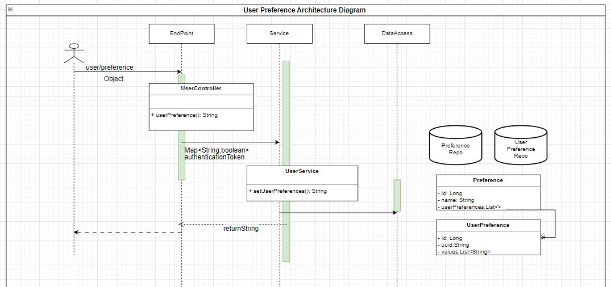

# User Preferences System Design Documentation

## Introduction

This document outlines the design of a User Preferences system, which allows users to set and manage their preferences using an HTTP API. Users can send a POST request to the **`user/preference`**
 endpoint with a **`Map<String,Boolean>`**
 to update their preferences. The request is then handled by the **`UserController`**
 and the preference data is passed to the **`UserService`**
 for processing. The **`UserService`**
 manipulates the data and updates the database with the new preferences.

## Entities

The User Preferences system has two entities: **`Preference`** and **`UserPreference`**.

### Preference Entity

The **`Preference`** entity represents a single preference that a user can select. It has the following fields:

- **`id`**: A unique identifier for the preference.
- **`name`**: A string representing the name of the preference.

### UserPreference Entity

The **`UserPreference`** entity represents a user's selected preferences. It has the following fields:

- **`id`**: A unique identifier for the user preference.
- **`uuid`**: A string representing the user's UUID.
- **`values`**: A list of strings representing the selected preferences.
- **`preference_id`** A Long which shows the relationship between the **`UserPreference`** and **`Preference`**.

### **Repositories**

The User Preferences system has two repositories: **`PreferenceRepository`** and **`UserPreferenceRepository`**.

### PreferenceRepository

The **`PreferenceRepository`** is responsible for accessing and manipulating the **`Preference`** entity in the database.

### UserPreferenceRepository

The **`UserPreferenceRepository`** is responsible for accessing and manipulating the **`UserPreference`** entity in the database.

### **User/Preference Endpoint**

The **`user/preference`** endpoint is where users can send a POST request to update their preferences. The request body should be a JSON object with a **`Object`** which as two fields as shown in the example above and the boolean values indicate whether the preference is selected or not.

Example request body:

```json
{
  "_email_notification": true,
  "_sms_notification": false
}
```

Please ensure that you are using a consistent format for the keys.

### **UserController**

The **`UserController`** is responsible for handling requests to the **`user/preference`** endpoint. It has a method **`userPreference(Object preferences, Authentication authentication)`** that takes the preference data from the request and the **`Authentication`** object for user authentication.

The **`userPreference`** method checks if the user is authenticated and authorized to set preferences. If the user is authorized, the preference data is passed to the **`UserService`** for processing. If the user is not authorized, an error response is returned.

Example error response:

```json
{
  "message": "Unauthorized",
  "status": 40
}
```

### **UserService**

The **`UserService`** is responsible for manipulating the preference data and updating the database with the new preferences. It has a method **`setUserPreference(Object preferences, String UUID)`** that takes the preference data and the user's UUID.

The **`setUserPreference`** method checks if the user with the given UUID exists in the database. If the user exists, the preference data is updated in the database. If the user does not exist, an error response is returned.

Example error response:

```json
{
"message": "User not found",
  "status": 404
}
```

## Architecture Diagram



### **Conclusion**

The User Preferences system is designed to allow users to set and manage their preferences using an HTTP API. The system consists of the **`user/preference`** endpoint, **`UserController`**, and **`UserService`**. The endpoint allows users to send a POST request with their preference data, which is then handled by the **`UserController`**. The **`UserController`** checks user authentication and passes the data to the **`UserService`** for processing. The **`UserService`**
 updates the database with the new preferences and returns an error response if necessary.